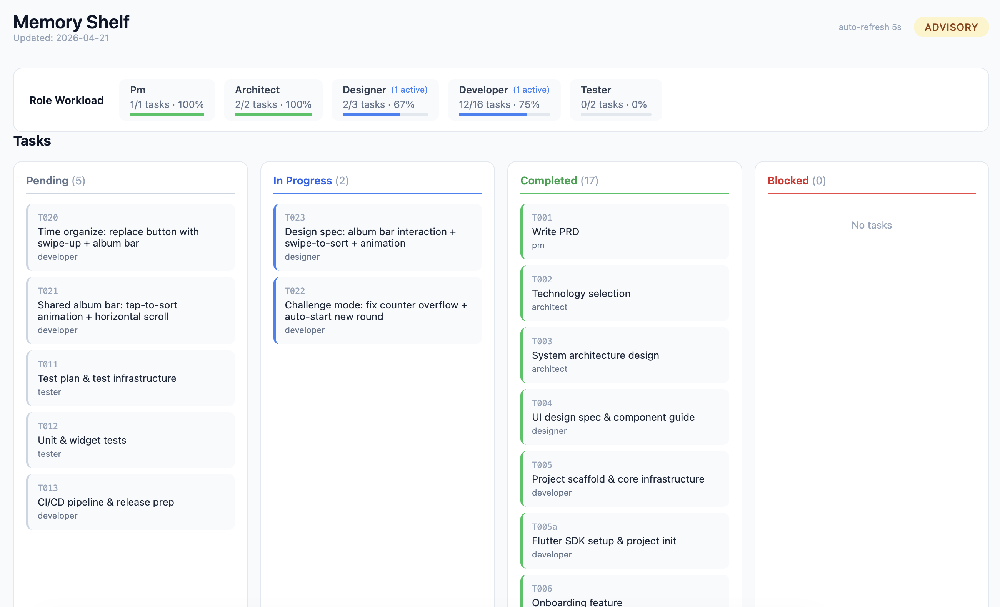

<p align="center">
  
  
  
</p>

<h1 align="center">Claude Crew</h1>

<p align="center">
  <strong>A multi-agent team system for Claude Code.</strong><br>
  Six specialized AI agents collaborate autonomously on your projects.<br>
  You provide the ideas. They handle the rest.
</p>

---

## What This Is

Claude Crew is an exercise in **harness engineering** — the practice of shaping AI behavior through structured prompts, role definitions, and process constraints rather than model fine-tuning or custom training.

The model stays the same. What changes is the **harness**: a set of skills, workflows, and templates that turn a single Claude instance into a coordinated team of six specialized agents. Every agent is the same model, but each behaves differently because its role definition constrains what it does, how it communicates, and what it produces.

> **No new model capabilities are created.** The engineering value lies entirely in how the model is orchestrated — role separation, task coordination, state management, and communication rules are all defined in plain markdown files that anyone can read and modify.

---

## Overview

Claude Crew turns Claude Code into a full development team. Describe your idea, and a team of specialized agents — PM, Architect, Designer, Developer, Tester, and DevOps — will decompose it into stages, design the architecture, build the code, write tests, and keep you informed through a live visual board.

```
/crew I want to build a cross-platform photo organizer app...

  PM        → Captures idea, writes PRD, manages tasks and board
  Architect → Selects tech stack, designs system architecture
  Designer  → Creates UI/UX specs, generates design tool prompts
  Developer → Scaffolds project, implements features, fixes bugs
  Tester    → Writes automated tests, reports defects
  DevOps    → Sets up CI/CD, manages builds and releases (optional)
```

<p align="center">
  
  <br>
  <em>Live project board — auto-refreshes every 5s, tracks stages, tasks, and role workload</em>
</p>

---

## Installation

**From source:**

```bash
git clone https://github.com/lvxiaoxin/Claude-Crew.git
cd Claude-Crew
./dev/install.sh
```

> Installs skills to `~/.claude/skills/` and templates to `~/.claude/claude-crew-templates/`. The script checks for conflicts before overwriting.

**Via plugin marketplace** (coming soon):

```
/plugin install claude-crew
```

---

## Quick Start

In any Claude Code session, run:

```
/crew [describe your project idea]
```

**What happens:**

1. **Preflight check** — verifies required tools are available
2. **Project bootstrap** — PM creates `docs/project/` with brief, task breakdown, and visual board
3. **Plan approval** — PM presents the plan for your review
4. **Execution** — agents work through stages: Requirements → Design → Development → Testing → Release
5. **Live board** — open `docs/project/board.html` in your browser (auto-refreshes every 5s)

---

## Team Roles

| Role | Responsibility | Key Outputs |
|:-----|:---------------|:------------|
| **PM** | Central coordinator. Decomposes ideas, assigns tasks, tracks progress, talks to you. Never writes code. | PRD, tasks.yaml, board.html, comms-log.md |
| **Architect** | Tech selection, system design, architecture docs. Researches via web, writes POC only when uncertain. | architecture.md, tech-selection.md |
| **Designer** | UI/UX design, interaction flows, visual specs. Generates prompts for external design tools. | ui-design.md, design-assets/ |
| **Developer** | Code scaffolding, feature implementation, bug fixes. Follows conventional commits. | Source code, api.md |
| **Tester** | Automated testing (unit, integration, widget/UI). Reports defects to Developer. | Test code, test-plan.md |
| **DevOps** | CI/CD, builds, repo management, monitoring, releases. *Optional — activated when needed.* | CI/CD configs, devops.md |

---

## Autonomy Levels

Control how much the team involves you:

| Level | Behavior | Best for |
|:------|:---------|:---------|
| **advisory** (default) | PM only escalates major decisions, risks, or ambiguity | Balanced oversight |
| **supervised** | PM seeks your approval at every stage gate | Full control |
| **autonomous** | Agents work independently; you monitor via the board | Maximum speed |

Switch anytime:

```
"switch to autonomous"
```

---

## Architecture

```
┌─────────────────────────────────────────────────┐
│                    You (Human)                   │
│              Provide ideas & feedback            │
└─────────────────────┬───────────────────────────┘
                      │
                      ▼
┌─────────────────────────────────────────────────┐
│                  PM (always on)                  │
│  Tasks · Board · Stage gates · Comms log        │
└──┬──────┬──────┬──────┬──────┬──────┬───────────┘
   │      │      │      │      │      │
   ▼      ▼      ▼      ▼      ▼      ▼
 Arch  Designer  Dev   Tester DevOps  ...
```

| Layer | Mechanism | Purpose |
|:------|:----------|:--------|
| Role definitions | `skills/agents/*.md` | Who each agent is and what they can do |
| Entry point | `/crew` slash command | Bootstraps PM and project structure |
| Task coordination | `tasks.yaml` + Task system | Single source of truth for all task state |
| Agent dispatch | `Agent` tool (background) | PM dispatches roles without blocking |
| Persistence | `docs/project/` files | Board, tasks, docs — survives across sessions |
| Audit trail | `comms-log.md` | All agent communications logged for review |

---

## Communication Matrix

```
         PM    Arch   Design  Dev    Test   DevOps  Human
PM        -     ✓      ✓       ✓      ✓      ✓       ✓
Arch      ✓     -      ✗       ✓      ✗      ✓       ✗
Design    ✓     ✗      -       ✓      ✗      ✗       ✗
Dev       ✓     ✓      ✓       -      ✓      ✓       ✗
Test      ✓     ✗      ✗       ✓      -      ✗       ✗
DevOps    ✓     ✓      ✗       ✓      ✗      -       ✗
```

- **PM is the only agent that talks to you.** All others escalate through PM.
- **Technical roles** discuss directly with connected peers (e.g., Architect ↔ Developer).
- **Cross-domain** communication routes through PM.
- **All communications** are logged to `docs/project/comms-log.md`.

---

## Project Lifecycle

### Startup
1. `/crew` triggers PM with your idea
2. PM runs preflight check, creates project structure
3. PM presents plan → you approve

### Execution
1. PM assigns tasks → updates board → dispatches agents in background
2. Agents execute (may discuss directly for technical details)
3. PM updates `tasks.yaml` + `board.html` on every state change
4. Stage complete → PM triggers stage-gate based on autonomy level

### Mid-Flight Input
You can talk to PM anytime during execution:

| Input type | PM behavior |
|:-----------|:------------|
| Minor detail | Records it, tasks continue |
| Requirement change | Notifies affected agents to pause/adjust |
| Bug report / feature request | Creates task, assigns to appropriate role, dispatches agent |
| Direction change | Halts affected tasks, re-plans, seeks confirmation |

> PM **never writes code itself**. All code changes go through Developer/Tester via task dispatch.

---

## Superpowers Integration

Agents leverage [superpowers](https://github.com/obra/superpowers) skills when installed. Not required — agents proceed without them.

| Agent | Skills Used |
|:------|:------------|
| PM | `brainstorming`, `writing-plans`, `verification-before-completion` |
| Architect | `brainstorming`, `verification-before-completion` |
| Designer | `brainstorming`, `verification-before-completion` |
| Developer | `test-driven-development`, `systematic-debugging`, `requesting-code-review`, `verification-before-completion` |
| Tester | `systematic-debugging`, `verification-before-completion` |
| DevOps | `verification-before-completion` |

> Agents **self-answer** any clarifying questions from skills using available project context — they don't relay skill questions to you.

---

## Project Files

When PM initializes a project, it creates:

```
your-project/
└── docs/project/
    ├── brief.md            # Your idea, structured
    ├── prd.md              # Product requirements
    ├── tasks.yaml          # Task state (single source of truth)
    ├── board.html          # Visual board (open in browser, auto-refreshes)
    ├── doc-index.md        # Central document index
    ├── comms-log.md        # Audit trail of all agent communications
    ├── architecture.md     # System architecture (Architect)
    ├── tech-selection.md   # Technology choices (Architect)
    ├── ui-design.md        # UI/UX design (Designer)
    ├── test-plan.md        # Test strategy (Tester)
    ├── api.md              # Interface docs (Developer)
    └── design-assets/      # Screenshots, mockups (Designer)
```

---

## Repository Structure

```
claude-crew/
├── .claude-plugin/
│   └── plugin.json              # Plugin metadata & dependency declarations
├── skills/
│   ├── crew/                    # /crew slash command entry point
│   │   └── SKILL.md
│   ├── agents/                  # Role definitions
│   │   ├── pm.md
│   │   ├── architect.md
│   │   ├── designer.md
│   │   ├── developer.md
│   │   ├── tester.md
│   │   └── devops.md
│   └── workflows/               # Coordination workflows
│       ├── project-init.md      # Project kickoff + preflight check
│       ├── stage-gate.md        # Stage approval transitions
│       └── board-update.md      # Board refresh on state change
├── templates/
│   └── project/                 # Deployed to ~/.claude/claude-crew-templates/
│       ├── tasks.yaml
│       └── board.html
└── docs/
    └── specs/                   # Design specifications
```

---

## Customization

All role definitions are markdown files in `skills/agents/`. You can:

- Adjust role responsibilities or boundaries
- Add new tools or MCP server integrations
- Change communication rules or autonomy defaults
- Modify workflow steps
- Add new agent roles

The system is **project-agnostic** — the same roles work for any project. Project-specific context is provided by you at startup and maintained by PM.

---

## Dependencies

| Type | Details | Required? |
|:-----|:--------|:----------|
| Claude Code built-ins | Read, Write, Edit, Bash, Agent, SendMessage, TaskCreate, etc. | Yes |
| WebSearch / WebFetch | For Architect's technical research | Recommended |
| MCP design tools | For Designer's direct tool integration | Optional (fallback: manual prompts) |
| Superpowers plugin | Enhanced workflows (TDD, debugging, code review) | Optional |

---

## License

MIT
